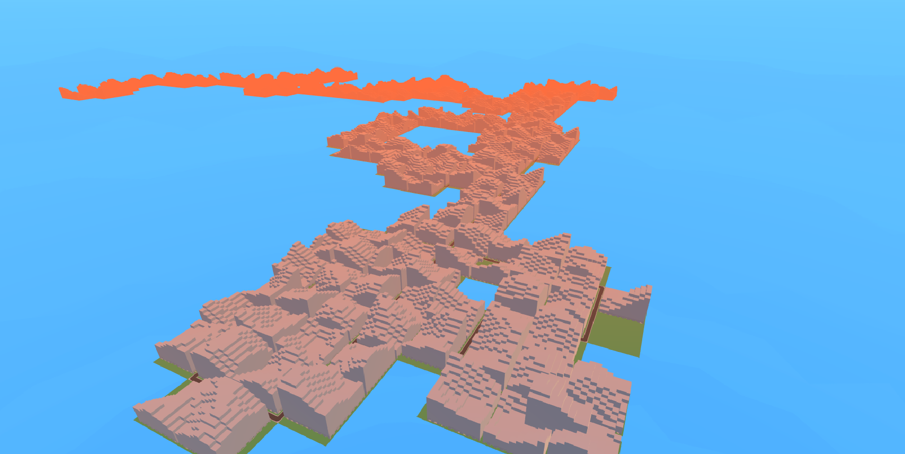
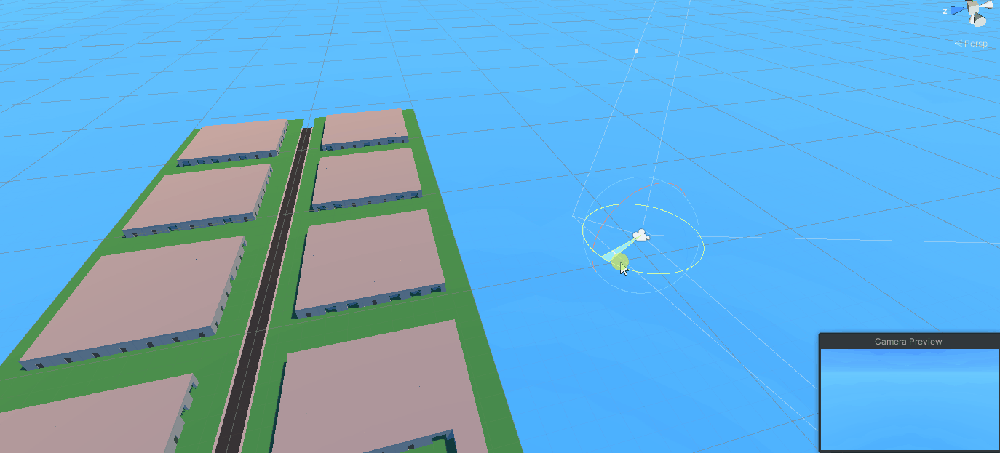

# City Generator

This project creates cities with random roads layout and random, procedurally generated buildings with use of Perlin Noise.

## Demo

## Optimizations

To optimize large amount of objects in the scene I used meshes combining. 
As a result, the number of draw calls decreased drastically.
The most significant change however, was adding a custom dynamic occlusion culling,
which enables mesh renderers for only visible objects 
(not occluded by other objects and within the camera's field of view).
It has been implemented by shooting fixed number of raycasts from current 
camera position, enabling hitted objects and hiding them again after 
fixed amount of time without being hitted. In order to increase the optimisation even further,
 it is advised to not create additional building parts within the structures.

